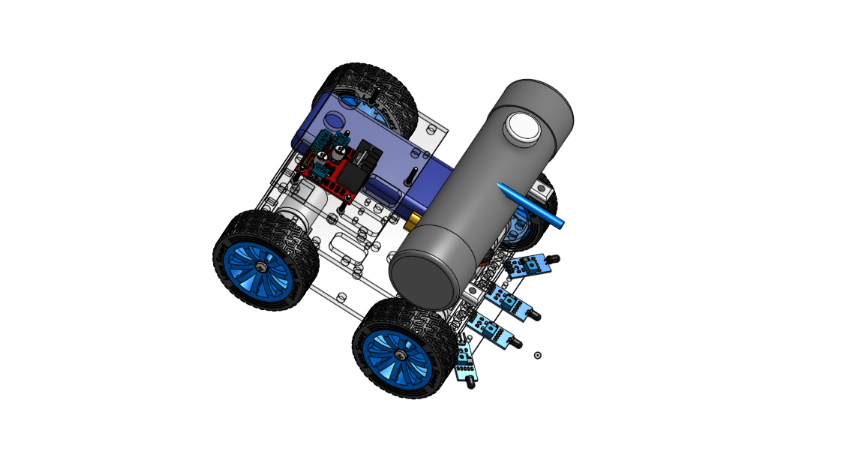
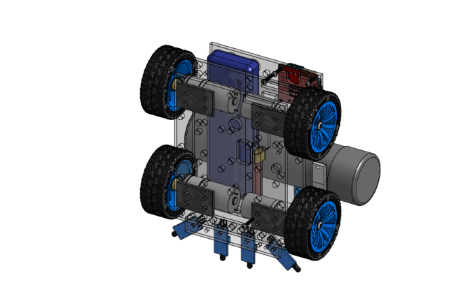
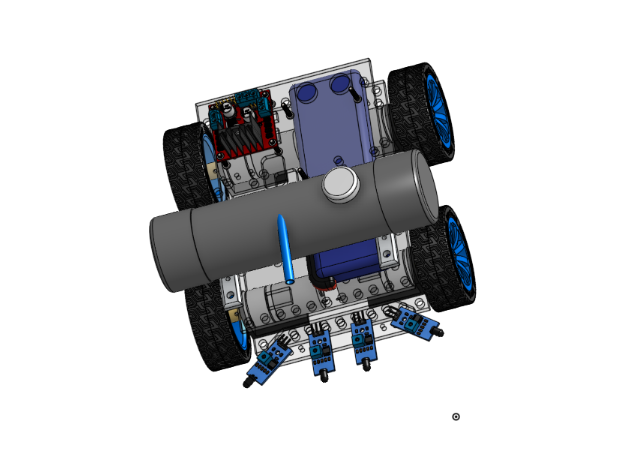
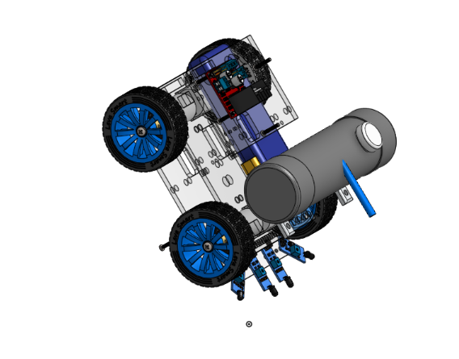

# Fire-Extinguish-Robot
Fire Extinguish Robot using arduino it main use is to locate and extinguish the fire with sencer and water pump 

I add CAD file i add two file one is single file of whole model and one is file with every part file and i was not able to add Raspberry Pi 5 model so it place it empty and i make this in onshape so i did not know how to get it source file

# This is a image of final 3d model our car going to look like this when it done

# this is Part list and what is it use

### 1. arduino

Main controller (“brain”)

Runs fire detection

Controls motors, sensors, pumps

Handles navigation/path planning

### 2. L298N V3 Four DC Motor Driver

Drives 4 DC motors

Controls direction & speed (PWM)

Suitable for mecanum wheel movement

### 3. 60mm Aluminum Mecanum Wheels

360° movement

Sideways/diagonal motion

Ideal for navigating tight spaces

### 4. Pro-Range 12V 300 RPM Johnson Geared Motors (x4)

Provide torque for mecanum wheels

Compatible with L298N

High strength for metal chassis

### 5. Advance Metal Chassis (x2)

Supports all components

Strong & fire-resistant

Base structure of the robot

### 6. MG995 (360°) Servo Motor

Rotates water nozzle

Aims water up/down/left/right

### 7. 12V 5000 RPM Peristaltic Pump

Pumps water safely

Used for spraying water on fire

### 8. EasyMech 6mm Coupling Hub

Connects motor shaft to mecanum wheel

Ensures proper alignment
